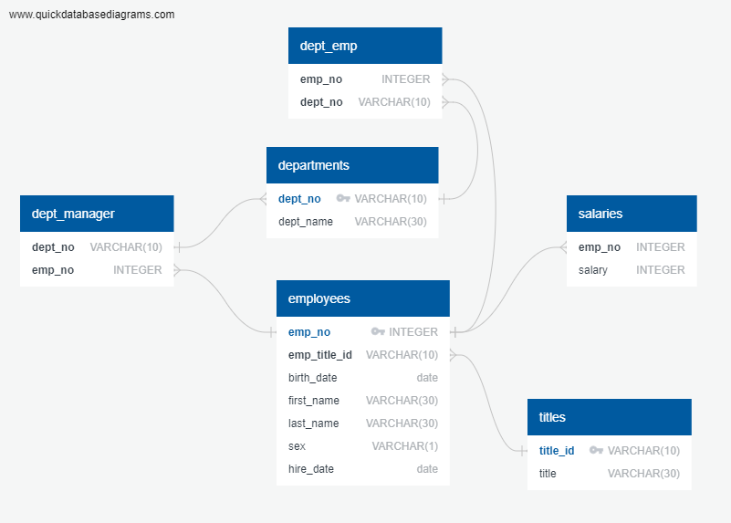

# Exploring Pewlett Hackard's Workforce of the 1980s and 1990s
A Data Modeling, Data Engineering, and Data Analysis

## Background
As a new data engineer at Pewlett Hackard (a fictional company), my first major task is doing a research project about people the company employed during the 1980s and 1990s. All that remains of the employee database from that period are six CSV files.
For this project, I’ll design the tables to hold the data from the CSV files, import the CSV files into a SQL database, and then answer questions about the data. That is, I’ll perform data modeling, data engineering, and data analysis, respectively.

### Instructions
This Challenge is divided into three parts: data modeling, data engineering, and data analysis.

### Data Modeling
I'll inspect the CSV files, and then sketch an Entity Relationship Diagram of the tables.
To create the sketch, I'll use a tool like QuickDBD [(https://www.quickdatabasediagrams.com/)]

### Data Engineering
  1: I'll use the provided information to create a table schema for each of the six CSV files. Also, I'll make sure to do the following:
    - I'll remember to specify the data types, primary keys, foreign keys, and other constraints.
    - For the primary keys, I'll verify that the column is unique. Otherwise, create a composite key to an external site., which takes two primary keys to uniquely identify a row.
    - I'll make sure to create the tables in the correct order to handle the foreign keys.

2: I"ll import each CSV file into its corresponding SQL table.

***Hint:*** 

To avoid errors, import the data in the same order as the corresponding tables got created. And, remember to account for the headers when doing the imports.

### Data Analysis
1: List the employee number, last name, first name, sex, and salary of each employee.

2: List the first name, last name, and hire date for the employees who were hired in 1986.

3: List the manager of each department along with their department number, department name, employee number, last name, and first name.

4: List the department number for each employee along with that employee’s employee number, last name, first name, and department name.

5: List the first name, last name, and sex of each employee whose first name is Hercules and whose last name begins with the letter B.

6: List each employee in the Sales department, including their employee number, last name, and first name.

7: List each employee in the Sales and Development departments, including their employee number, last name, first name, and department name.

8: List the frequency counts, in descending order, of all the employee last names (that is, how many employees share each last name).

***References***

Data generated by Mockaroo, LLCLinks to an external site., (2022). Realistic Data Generator.
